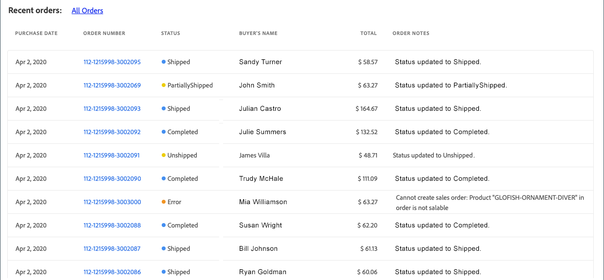
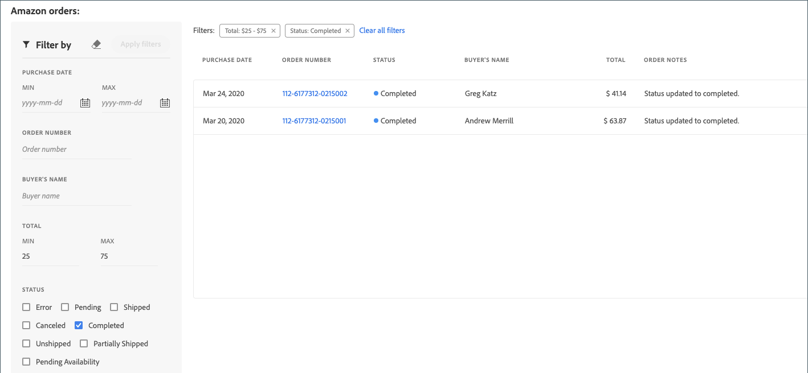

# Afficher les commandes Amazon

Il existe deux manières d’afficher vos commandes Amazon : _[!UICONTROL Recent Orders]_et_[!UICONTROL All Orders]_.

Les deux options vous montrent des informations de commande de base, telles qu’elles sont reçues d’Amazon, notamment :

- Date d’achat
- Numéro de commande
- État
- Nom de l’acheteur
- Total général
- Notes de commande

La vue _[!UICONTROL All Orders]_ajoute des options de filtrage pour les recherches de commande.

>[!NOTE]
>
>À l’exception de la colonne _[!UICONTROL Order Notes]_, la table_[!UICONTROL Amazon orders]_ est remplie avec les informations de commande reçues d’Amazon. La colonne _Notes de commande_ est mise à jour par [!DNL Commerce] pendant le traitement de la commande.

## Commandes récentes

Vous pouvez afficher vos commandes les plus récentes dans la section _[!UICONTROL Recent Orders]_du [tableau de bord du magasin](./amazon-store-dashboard.md).

{width="600" zoomable="yes"}

### Afficher les commandes Amazon récentes

1. Cliquez sur **[!UICONTROL View Store]** sur une carte de magasin.

1. Affichez vos commandes dans la section _[!UICONTROL Recent Orders]_.

1. Pour afficher les détails de la commande, cliquez sur le numéro de commande Amazon dans la colonne _[!UICONTROL Order Number]_.

   La page _[!UICONTROL Amazon Order Details]_de la commande s’ouvre.

## Afficher toutes les commandes

Vous pouvez afficher toutes vos commandes Amazon sur la page _[!UICONTROL Amazon orders]_(également appelée vue_[!UICONTROL All Orders]_). La table Commandes Amazon est similaire à la section _[!UICONTROL Recent Orders]_du tableau de bord du magasin, mais vous permet de visualiser toutes vos commandes Amazon et de réduire votre liste de commandes à l’aide des options de filtre suivantes :

- [!UICONTROL Purchase Date (range)]
- [!UICONTROL Order Number]
- [!UICONTROL Buyer's Name]
- [!UICONTROL Total (range)]
- [!UICONTROL Status]

{width="600" zoomable="yes"}

### Afficher toutes les commandes Amazon

1. Cliquez sur **[!UICONTROL View Store]** sur une carte de magasin.

1. Cliquez sur **[!UICONTROL All Orders]** dans la section _[!UICONTROL Recent Orders]_.

1. Pour réduire la liste ou rechercher un numéro de commande spécifique, renseignez les paramètres **[!UICONTROL Filter by]** et cliquez sur **[!UICONTROL Apply filters]**.

1. Pour afficher les détails de la commande, cliquez sur le numéro de commande Amazon dans la colonne _[!UICONTROL Order Number]_.

   La page _[!UICONTROL Amazon Order Details]_de la commande s’ouvre.

## Utilisation des filtres

Vous pouvez appliquer des filtres à votre liste de commandes dans la section _[!UICONTROL Filter by]_. Effectuez vos sélections et cliquez sur **[!UICONTROL Apply filters]**. Les filtres appliqués s’affichent au-dessus de la grille des commandes.

{width="600" zoomable="yes"}

### Modification des filtres appliqués

- Vous pouvez ajouter ou modifier vos filtres dans la section _[!UICONTROL Filter by]_. Cliquez sur **[!UICONTROL Apply filters]**pour mettre à jour la liste des commandes et les options de filtrage qui apparaissent au-dessus de la grille des commandes.

- Vous pouvez supprimer des filtres un par un en cliquant sur le `x` correspondant au filtre ou tous en même temps en cliquant sur **[!UICONTROL Clear all filters]**. La suppression d’un filtre met à jour la liste des commandes et les options de filtrage qui apparaissent au-dessus de la grille des commandes.

- Si votre liste de commandes est longue, vous pouvez utiliser les commandes de pagination situées sous la grille pour afficher davantage de commandes.

>[!TIP]
>
>Quelques conseils sur la vue des commandes :
>
>- Si vous disposez de plusieurs intégrations de magasin Amazon, une actualisation de la page vue lors du basculement entre les vues de magasin peut s’avérer nécessaire pour mettre à jour la liste des commandes et les vues de pagination du magasin actuel.
>- Lors du tri par colonne, le tri ne s’applique qu’au mode Liste actuel. Il est recommandé de filtrer votre liste, puis de trier la page que vous affichez.
>- Selon la largeur de la fenêtre d’affichage, le texte des colonnes peut se chevaucher. Pour agrandir les colonnes pour que le texte soit renvoyé à la ligne, élargissez la vue de la fenêtre.
>- Lors du filtrage par _[!UICONTROL Total]_, filtrez par nombres entiers. La saisie d’un nombre décimal peut entraîner des erreurs dans les résultats.

### Colonnes par défaut

| Colonne | Description |
|----------------------------|------------------------------------------------------------------------------------------------------------------------------------------------------------------------------------------------------------------------------------------------------------|
| [!UICONTROL Filter by] | Disponible uniquement dans la vue _[!UICONTROL All Orders]_. Limitez la liste des commandes en fonction des éléments suivants :<ul><li>`Purchase Date (range)`</li><li>`Order Number`</li><li>`Buyer's Name`</li><li>`Total (range)`</li><li>`Status`</li></ul> |
| [!UICONTROL Purchase Date] | Date de l’achat, telle qu’elle a été reçue d’Amazon. |
| [!UICONTROL Order Number] | Numéro de commande généré par et reçu d’Amazon. Pour afficher l’écran Détails de la commande Amazon, cliquez sur le lien. |
| [!UICONTROL Status] | État de la commande, tel que reçu par Amazon. Options : `Error` / `Pending` / `Shipped` / `Canceled` / `Completed` / `Unshipped` / `PartiallyShipped` / `PendingAvailability` |
| [!UICONTROL Buyer's Name] | Nom de la personne qui a passé la commande, tel qu’il a été reçu d’Amazon. |
| [!UICONTROL Grand Total] | Valeur monétaire totale de la commande, telle qu’elle est reçue d’Amazon. |
| [!UICONTROL Order Notes] | Action la plus récente enregistrée pour la commande lors de son traitement dans [!DNL Commerce]. Les informations incluent, sans s’y limiter, les erreurs d’importation de commande et les mises à jour de traitement des commandes. **Remarque** : Ce champ est mis à jour par [!DNL Commerce] lors du traitement de la commande. |
