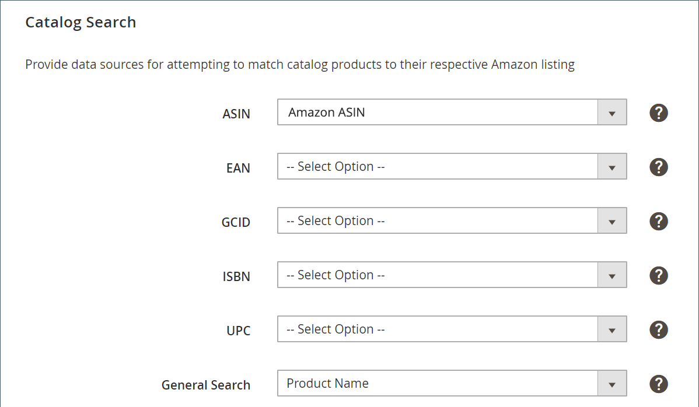

# Recherche catalogue de listes Amazon

_Recherche catalogue_ font partie des paramètres de liste des magasins. Les paramètres de liste sont accessibles à partir du [tableau de bord de la boutique](./amazon-store-dashboard.md).

Ces paramètres vous permettent de définir la correspondance des attributs qui aide à mapper les attributs éligibles. [!DNL Commerce] produits avec des listes Amazon. Lorsqu’il est mappé, Amazon active des actions liées à la tarification, à la quantité, aux remplacements et à la synchronisation des commandes et des produits.

La définition de ces valeurs de mappage augmente le risque de correspondances exactes, ce qui réduit la nécessité de faire correspondre manuellement les listes de produits. Ajout des attributs dans le cadre de votre [Tâches préalables à la configuration](./amazon-pre-setup-tasks.md), le canal de vente Amazon présente un potentiel plus élevé de mise en correspondance automatique de vos produits lors de l’intégration et de la synchronisation des données de produit entre Amazon et [!DNL Commerce].

Si vous créez uniquement l’attribut Amazon ASIN (sans ajouter de valeurs ASIN par produit), votre [!DNL Commerce] les produits peuvent ne pas correspondre automatiquement à vos listes Amazon. Vous pouvez [affectation manuelle](./creating-assigning-catalog-products.md) vos produits. Toutefois, la correspondance manuelle ne crée pas les éléments de données nécessaires pour partager et synchroniser les données de vos produits.

>[!IMPORTANT]
>
>Si vous avez fait correspondre manuellement un produit et que vous souhaitez mettre à jour un élément de données ASIN, UPC ou autre pour le produit, vous devez mettre à jour les données à deux endroits. Mettez-le à jour dans votre [!DNL Commerce] catalogue et dans votre liste Amazon dans votre [!DNL Amazon Seller Central] compte .

Il est recommandé de mapper ces attributs et valeurs si possible. L’achèvement de ce mappage n’est pas obligatoire, mais il est bénéfique pour la mise en correspondance des produits et nécessaire pour une synchronisation de catalogue correcte entre Amazon et [!DNL Commerce].

Si vous souhaitez ajouter des attributs, reportez-vous à la section [Création d’attributs de produit pour la correspondance Amazon](./ob-creating-magento-attributes.md).

## Configurer [!UICONTROL Catalog Search] paramètres

1. Cliquez sur **[!UICONTROL Listing Settings]** dans le tableau de bord de la boutique.

1. Développez l’objet _[!UICONTROL Catalog Search]_.

1. Pour **[!UICONTROL ASIN]**, sélectionnez l’attribut de produit que vous avez créé pour la valeur Amazon ASIN .

   Un ASIN ([!DNL Amazon Standard Identification Number]) est un bloc unique de dix lettres et/ou nombres qui identifie les éléments. Pour les livres, l&#39;ASIN est le même que le numéro ISBN, mais pour tous les autres produits, un nouvel ASIN est créé lorsque l&#39;article est téléchargé dans son catalogue. Vous trouverez un ASIN d’articles sur la page des détails du produit dans Amazon, ainsi que d’autres détails relatifs à l’article.

1. Pour **[!UICONTROL EAN]**, choisissez l’attribut de produit que vous avez créé pour la valeur EAN Amazon.

   Le numéro d’article européen (EAN) est un code-barres, un code d’identification de produit à 12 ou 13 chiffres. Chaque EAN identifie de manière unique le produit, le fabricant et ses attributs. généralement, l’EAN est imprimé sur une étiquette de produit ou un emballage sous forme de code-barres. Amazon nécessite des codes EAN pour améliorer la qualité des résultats de recherche et la qualité du catalogue. Vous pouvez obtenir les EAN auprès du fabricant.

1. Pour **[!UICONTROL GCID]**, choisissez l’attribut de produit que vous avez créé pour la valeur Amazon GCIN.

   L’identifiant de catalogue global (GCID) est un identifiant pour les produits qui ne comportent pas de code UPC ou d’ISBN. Amazon Brand Registry vous permet de vous enregistrer en tant que propriétaire de marque et de créer un identifiant unique pour les produits.

1. Pour **[!UICONTROL ISBN]**, choisissez l’attribut de produit que vous avez créé pour la valeur Amazon ISBN.

   L&#39;International Standard Book Number (ISBN) est un code-barres unique et unique, portant l&#39;identifiant d&#39;un livre commercial. Chaque code ISBN identifie un livre de façon unique. Un ISBN a soit dix, soit 13 chiffres. Tous les ISBN attribués après le 1er janvier 2007 ont 13 chiffres.

1. Pour **[!UICONTROL UPC]**, sélectionnez l’attribut de produit que vous avez créé pour la valeur Amazon UPC.

   Le code universel de produit (UPC) est un code-barres de 12 chiffres utilisé de manière intensive pour les emballages de vente au détail aux États-Unis.

1. Pour **[!UICONTROL General Search]**, choisissez l’attribut de produit que vous souhaitez utiliser pour une correspondance de recherche générale.

   Cet attribut peut être sélectionné pour correspondre à [!DNL Commerce] produits à la liste Amazon appropriée. La recherche générale utilise les recherches de mots-clés de votre catalogue. Il est donc recommandé d’utiliser une [!DNL Commerce] qui contient des mots-clés pertinents, tels que le SKU du produit ou le nom du produit. La recherche générale peut renvoyer de nombreuses correspondances possibles. Dans ce cas, vous pouvez sélectionner la liste Amazon appropriée parmi les correspondances possibles. Une sélection courante pour ce champ est la suivante : `Product Name`.

1. Une fois l’opération terminée, cliquez sur **[!UICONTROL Save listing settings]**.

{width="500" zoomable="yes"}

| Champ | Description |
|--------------------------------------------------------|--------------------------------------------------------------------------------------------------------------------------------------------------------------------------------------------------------------------------------------------------------------------------------------------------------------------------------------------------------------------------------------------------------------------------------------------------------------------------------------------------------------------------------------|
| [!UICONTROL ASIN] | Un bloc unique de 10 lettres et/ou chiffres qui identifient les éléments.  ASIN signifie [!DNL Amazon Standard Identification Number]. Un ASIN est un bloc unique de 10 lettres et/ou nombres qui identifie les éléments. Pour les livres, l&#39;ASIN est le même que le numéro ISBN, mais pour tous les autres produits, un nouvel ASIN est créé lorsque l&#39;article est téléchargé dans son catalogue. Vous trouverez un ASIN d’articles sur la page des détails du produit dans Amazon, ainsi que d’autres détails relatifs à l’article. |
| [!UICONTROL EAN (European Article Number)] | Code d’identification de produit à 12 ou 13 chiffres. Le numéro d’article européen (EAN) est un code-barres, un code d’identification de produit à 12 ou 13 chiffres. Chaque EAN identifie de manière unique le produit, le fabricant et ses attributs. généralement, l’EAN est imprimé sur une étiquette de produit ou un emballage sous forme de code-barres. Amazon nécessite des codes EAN pour améliorer la qualité des résultats de recherche et la qualité du catalogue. Vous pouvez obtenir les EAN auprès du fabricant. |
| [!UICONTROL GCID (Global Catalog Identifier)] | L’identifiant de catalogue global (GCID) est un identifiant pour les produits qui ne comportent pas de code UPC ou d’ISBN. Amazon Brand Registry vous permet de vous enregistrer en tant que propriétaire de marque et de créer un identifiant unique pour les produits qui ne possèdent pas de CUP ou d’ISBN. |
| [!UICONTROL ISBN (International Standard Book Number)] | Code à barres d’identifiant de livre commercial unique à 10 ou 13 chiffres. L&#39;International Standard Book Number (ISBN) est un code-barres unique et unique, portant l&#39;identifiant d&#39;un livre commercial. Chaque code ISBN identifie un livre de façon unique. Un ISBN a soit dix, soit 13 chiffres. Tous les ISBN attribués après le 1er janvier 2007 ont 13 chiffres. |
| UPC (Universal Product Code) | Code à barres à 12 chiffres. Le code universel de produit (UPC) est un code-barres de 12 chiffres utilisé de manière intensive pour les emballages de vente au détail aux États-Unis. |
| [!UICONTROL General Search] | Sélectionnez un attribut. Cet attribut peut être sélectionné pour correspondre à [!DNL Commerce] produits à la liste Amazon appropriée. La recherche générale utilise les recherches de mots-clés de votre catalogue. Il est donc recommandé d’utiliser une [!DNL Commerce] qui contient des mots-clés pertinents, tels que le SKU du produit ou le nom du produit. La recherche générale peut renvoyer de nombreuses correspondances possibles. Dans ce cas, vous pouvez sélectionner la liste Amazon appropriée parmi les correspondances possibles. Une sélection courante pour ce champ est la suivante : `Product Name`. |

**Accès rapide** - [!UICONTROL Listing Settings] sections

- [[!UICONTROL Product Listing Actions]](./product-listing-actions.md)
- [[!UICONTROL Third Party Listings]](./third-party-listing-settings.md)
- [[!UICONTROL Listing Price]](./listing-price.md)
- [[!UICONTROL (B2B) Business Price]](./business-pricing.md)
- [[!UICONTROL Stock / Quantity]](./stock-quantity.md)
- [[!UICONTROL Fulfilled By]](./fulfilled-by.md)
- [[!UICONTROL Catalog Search]](./catalog-search.md)
- [[!UICONTROL Product Listing Condition]](./product-listing-condition.md)
