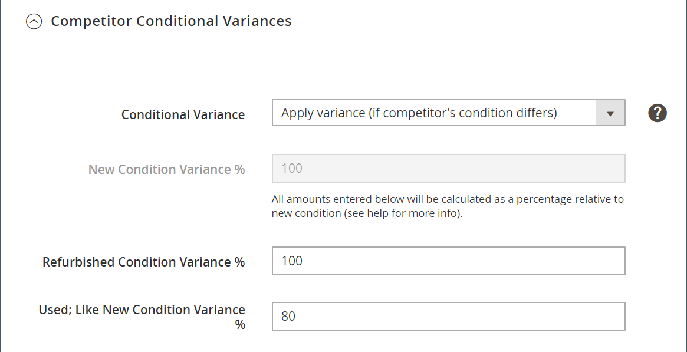

# Règle de tarification intelligente : Écarts conditionnels des concurrents

Les sections d’une règle de retarification intelligente incluent :

- [[!UICONTROL Select Rule Type]](./intelligent-repricing-rules.md)
- [!UICONTROL Competitor Conditional Variances]
- [[!UICONTROL Price Adjustment]](./price-adjustment.md)
- [[!UICONTROL Floor Price]](./floor-price.md)
- [[!UICONTROL Optional Ceiling Price]](./optional-ceiling-price.md)

Une règle de retarification intelligente utilise le prix des concurrents Amazon pour déterminer le prix de votre offre. Les concurrents sont d’autres vendeurs qui répertorient les mêmes produits que ceux répertoriés sur Amazon.

Si un produit contient la même condition, le prix de correspondance de base est le [concurrent le plus faible](./lowest-competitor-pricing.md) prix avec la même condition. Si aucun produit concurrent ne correspond à votre condition, le prix de correspondance de base passe ensuite par d’autres conditions de concurrent disponibles, en commençant par Nouveau, Réaménagé et en continuant par les conditions disponibles. Une fois qu’une condition est trouvée, le prix de correspondance de base est le prix le plus bas dans cette condition.

Si un produit est répertorié avec la condition `Used; Good` et le prix de correspondance de base, et un concurrent ayant le même produit dans la même condition à un prix inférieur, le prix du concurrent est utilisé. Si un concurrent n’existe pas avec la même condition, le système recherche un concurrent avec la condition suivante, à savoir : `New`. Si un concurrent respecte cette condition, le prix le plus bas est utilisé.

## Configuration des variations conditionnelles des concurrents

Définissez les écarts de condition dans la variable _[!UICONTROL Competitor Conditional Variances]_.

Pour **[!UICONTROL Conditional Variance]**, choisissez une option :

- `Use all competitor's product conditions` - (Par défaut) Choisissez le moment où vous souhaitez comparer votre produit à une condition disponible (si une correspondance n’existe pas pour la condition que vous mettez en liste).

- `Use Only Matching Competitor's Product Condition` - Choisissez quand vous souhaitez que votre produit soit comparé uniquement aux produits d’un concurrent dans la même condition. S’il n’existe aucune correspondance, le produit est facturé à l’adresse _Source du prix Magento_ défini dans votre [Prix d’énumération](./listing-price.md).

- `Apply Variance (if competitor's product condition differs)` - Choisissez d’abord d’essayer de comparer votre condition de produit correspondante. S’il n’existe aucune condition correspondante, une variance (en pourcentage) est appliquée par rapport à votre condition de produit et à la condition du concurrent le plus faible.

  Lorsque la variable _[!UICONTROL Apply Variance]_est choisie, d’autres champs de variance s’affichent pour chacune de vos conditions Amazon. Cette fonctionnalité vous permet d’utiliser des règles intelligentes de retarification lorsque vous proposez des produits dans un état différent de celui de vos concurrents. Pour comprendre le calcul de la variance conditionnelle, vous devez d’abord comprendre que toute variance est déterminée à partir d’un prix de correspondance de base.

  Les options d’écart conditionnel qui s’affichent dépendent des paramètres de votre liste pour `Condition` qui sont mappés à des valeurs de condition à l’aide d’un [!DNL Commerce] [attribut de produit](https://experienceleague.adobe.com/docs/commerce-admin/catalog/product-attributes/product-attributes.html). Pour toutes les conditions mappées, vous pouvez définir un pourcentage de variance de 1 à 100. L’exception concerne les objets de collection, auquel cas un pourcentage supérieur à 100 peut être appliqué.

{width="500" zoomable="yes"}

| Champ | Description |
|-----------------------------------------------|------------------------------------------------------------------------------------------------------------------------------------------------------------------------------------------------------------------------------------------------------------------------------------------------------------------------------------------------------------------------------------------------------------------------------------------------------------------------------------------------------------------------------------------------------------------------------------------------------------------------------------------------------------------------------------------------------------------------------------------------------------------------------------------------------------------------------------------------------------------------------------------------------------------------------------------------------------------------------------------------------------------------------------------------------------------------------------------------------------------------------------------------------------------------------------------------------------------------------------------------------------------------------------------------------------------------------------------------------------------------------------------------------------------------------------------------------------------------------------------------------------------------------------------------------------------------------------------------------------------------------------------------|
| [!UICONTROL Competitor Conditional Variances] | Options : <ul><li>**[!UICONTROL Use all competitor's product conditions]** - Si aucune correspondance n’existe pour la condition avec laquelle vous mettez en liste votre produit, cette option correspond à n’importe quelle condition disponible. Il tente d’abord de correspondre à votre condition, puis s’exécute à partir de la fonction `New` condition `Used; Acceptable`.</li><li>**[!UICONTROL Use only matching competitor's product condition]** - Cette option correspond à la condition de votre produit. S’il n’existe aucune correspondance, les prix du produit au niveau de la variable _[!UICONTROL Magento Price Source]_.</li><li>>**[!UICONTROL Apply variance (if competitor's product condition differs)]** - Cette option tente d’abord de correspondre à votre condition de produit. S’il n’existe aucune condition correspondante, elle applique une variance (en pourcentage) par rapport à votre condition de produit et à la condition du concurrent le plus faible.</li></ul>  Les options d’écart conditionnel qui s’affichent en fonction des paramètres de liste de la condition mappés aux valeurs de condition à l’aide d’une [!DNL Commerce] [attribut de produit](https://experienceleague.adobe.com/docs/commerce-admin/catalog/product-attributes/product-attributes.html). Pour toutes les conditions mappées, vous pouvez indiquer un pourcentage de variance de 1 à 100. L’exception concerne les objets de collection, auquel cas un pourcentage supérieur à 100 peut être appliqué.  Cette fonctionnalité vous permet d’utiliser des règles intelligentes de retarification lorsque vous proposez des produits dans un état différent de celui de vos concurrents. Pour comprendre le calcul de la variance conditionnelle, vous devez d’abord comprendre que toute variance est déterminée à partir d’un prix de correspondance de base. |

## Calcul de la base des variations conditionnelles

- Variance de condition de correspondance de base (BMC) = variance de la condition de votre concurrent de prix de correspondance de base. En reprenant l’exemple précédent, BMC est la variance de la variable `New` condition.
- Variance de condition du marché (MCV) = variance de la condition de votre produit. En utilisant l’exemple précédent, MCV = la variance de la variable `Used; Good` condition.
- Prix de la correspondance de base (BMP) = 7,99 $ (expliqué ci-dessus)

La formule de calcul de la base de variance conditionnelle est la suivante :

{width="300"}

## Exemple

Les paramètres d’écart conditionnel sont les suivants :

{width="500" zoomable="yes"}

- BMC = 100 (Condition du concurrent = Nouveau)
- MCV = 80 (condition du commerçant = utilisé) Good)
- BMP = 7,99 $ (prix de correspondance de base = prix le plus bas de la condition de concurrent égalé)

{width="300"}

En utilisant le calcul de la base des écarts conditionnels ci-dessus, votre base des écarts conditionnels = 6,39 $. Ce calcul est la source de prix du concurrent utilisée pour vos actions de règle de prix, comme expliqué plus loin dans la section [Ajustement des prix](./price-adjustment.md).
