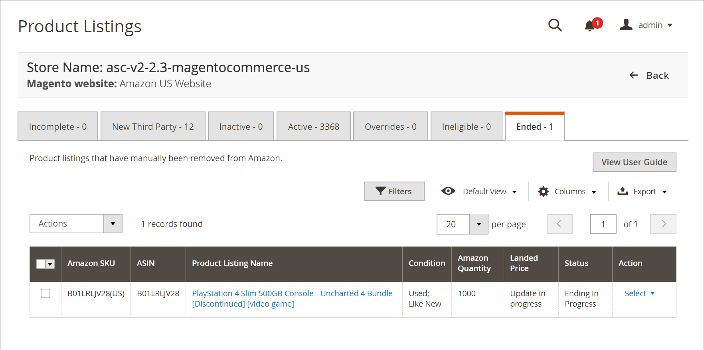

# Annonces terminées

Le _[!UICONTROL Ended]_affiche tous les produits Amazon qui ont été manuellement terminés (supprimés) de votre [!DNL Amazon Seller Central] compte. Ces produits répondent à toutes les exigences de mise en vente et peuvent être republiés à tout moment et ne nécessitent pas d’informations supplémentaires. Si un produit se trouve dans le noeud_[!UICONTROL Ineligible]_ , vous pouvez choisir de modifier votre [paramètres de liste](./listing-settings.md) afin que votre produit réponde aux critères d’admissibilité.

>[!NOTE]
>
>Si vous avez des annonces en cours de traitement, le nombre d’annonces s’affiche dans un message au-dessus des onglets.

Sous _[!UICONTROL Actions]_:

- **[!UICONTROL Publish Product to Amazon]**: Choisissez de republier la liste dans le dossier [!DNL Amazon Marketplace]. Voir [Publication d&#39;une liste Amazon](./publish-listings-manually.md)

Sous **[!UICONTROL Select]** dans la _[!UICONTROL Action]_colonne :

- **[!UICONTROL View Details]**: choisissez d’afficher les détails de la liste, y compris le [Journal d&#39;activité d&#39;annonce](./product-listing-details.md#listing-activity-log), [Prix des concurrents Buy Box](./product-listing-details.md#buy-box-competitor-pricing)et [Prix compétitif le plus bas](./product-listing-details.md#lowest-competitor-pricing). Cette action est destinée à l’affichage uniquement. Aucune modification ne peut être apportée aux détails de la liste. Voir [Afficher les détails](./product-listing-details.md).

- **[!UICONTROL Publish On Amazon]**: Choisissez de republier la liste dans le dossier [!DNL Amazon Marketplace]. Voir [Publication d&#39;une liste Amazon](./publish-listings-manually.md).

- **[!UICONTROL Create Alias Seller SKU]**: choisissez de créer une UGS d&#39;alias qui peut être utilisée pour créer une liste Amazon à partir du même produit de catalogue. Voir [Créer une référence de fournisseur d&#39;alias](./create-alias-seller-sku.md).

Pour les annonces de fin, voir [Fin d&#39;une liste Amazon](./end-listings-manually.md).

Pour publier des annonces, voir [Publication manuelle d’une liste Amazon](./publish-listings-manually.md).

Les pages d&#39;accueil du canal de vente Amazon partagent certaines parties communes [commandes de l’espace de travail](./workspace-controls.md) qui vous permettent de personnaliser les données affichées.

| Colonne | Description |
|--- |--- |
| [!UICONTROL Amazon Seller SKU] | La référence SKU (Stock Keeping Unit) attribuée par Amazon à un produit pour identifier le produit, les options, le prix et le fabricant. |
| [!UICONTROL ASIN] | Bloc unique de 10 lettres et/ou chiffres identifiant des éléments.  ASIN est l&#39;acronyme d&#39;Amazon Standard Identification Numbers. Un ASIN est un bloc unique de 10 lettres et/ou chiffres qui identifie des éléments. Pour les livres, l’ASIN est identique au numéro ISBN, mais pour tous les autres produits, un nouvel ASIN est créé lorsque l’élément est chargé dans leur catalogue. Vous pouvez trouver un ASIN articles sur la page de détails du produit sur Amazon, ainsi que d’autres détails relatifs à l’article. |
| [!UICONTROL Product Listing Name] | Nom du produit. |
| [!UICONTROL Condition] | Le [condition](./product-listing-condition.md) du produit. |
| [!UICONTROL Landed Price] | Le prix d&#39;annonce du produit plus son prix d&#39;expédition. |
| [!UICONTROL Amazon Quantity] | Quantité disponible lorsque le produit est activement répertorié sur Amazon. |
| [!UICONTROL Status] | Statut de la liste, défini par Amazon. |
| [!UICONTROL Action] | Liste des actions disponibles pouvant être appliquées à une liste spécifique. Pour appliquer une action, cliquez sur **[!UICONTROL Select]** dans la _[!UICONTROL Action]_et sélectionnez l’élément :<ul><li>[[!UICONTROL View Details]](./product-listing-details.md)</li><li>[[!UICONTROL Publish On Amazon]](./publish-listings-manually.md)</li><li>[[!UICONTROL Create Alias Seller SKU]](./create-alias-seller-sku.md#region-specific)</li></ul> |
