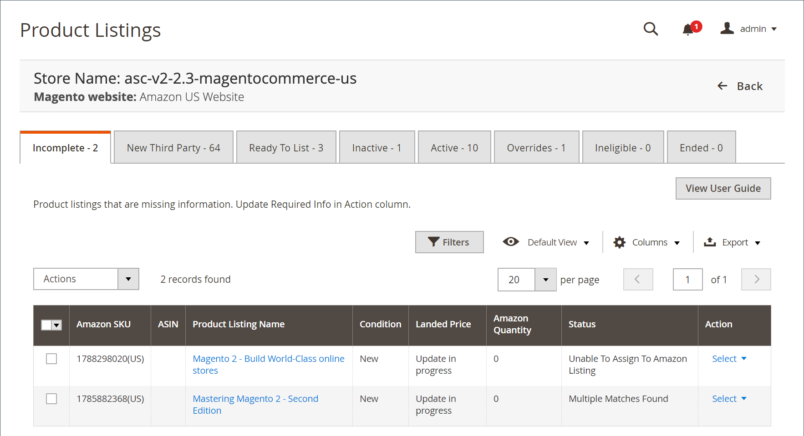

# Listes Amazon incomplètes

L’onglet _[!UICONTROL Incomplete]_répertorie les produits du catalogue [!DNL Commerce] qui répondent à vos exigences d’éligibilité Amazon (définis dans vos [ règles de liste ](./listing-rules.md)), mais qui ne contiennent pas les informations requises par Amazon (comme l’Amazon ASIN ou une condition de produit définie).

Il existe quatre causes possibles à une liste incomplète, chacune identifiée par son état.

| État | Motif | Action |
|------------------------------------|-------------------------------------------------------------------------------------------------------------------------------------------------------------------------------------------------|----------------------------------------------------------------------------------------------------------------------------------------------------------------------------------------------------------------|
| Condition manquante | Amazon accepte les listes dans diverses conditions (telles que _New_, _Reeuvré_, _Utilisé : comme nouveau_), requiert une condition définie. | Mettez à jour les informations requises et affectez manuellement [une condition](./amazon-manually-update-incomplete-listing.md#update-required-info-missing-condition) à une liste. |
| Impossible d’affecter à la liste Amazon | Échec de la correspondance automatique de cette liste avec votre catalogue. Si aucune correspondance n’est trouvée, la liste ne peut pas être gérée par Amazon Sales Channel. | Mettez à jour les informations requises et [affectez manuellement un ASIN](./amazon-manually-update-incomplete-listing.md#update-required-info-unable-to-assign-to-amazon-listing) au produit de catalogue pour qu’il corresponde à la liste. |
| Plusieurs correspondances trouvées | Échec de la correspondance automatique de cette liste avec votre catalogue. Si plusieurs correspondances possibles sont trouvées, vous devez sélectionner la correspondance correcte pour votre produit. | Mettez à jour les informations requises et [sélectionnez manuellement une correspondance de produit](./amazon-manually-update-incomplete-listing.md#update-required-info-multiple-matches-found) pour le produit et la liste. |
| Contient des variantes | Si votre produit comporte des variantes, telles qu’un t-shirt disponible dans différentes tailles ou couleurs, vous devez choisir la variante de votre catalogue à attribuer et à associer correctement à la liste. | Mettez à jour les informations requises et [sélectionnez manuellement la variante correcte](./amazon-manually-update-incomplete-listing.md#update-required-info-has-variants) à affecter et à associer à cette liste. |

>[!NOTE]
>Lorsque des listes incomplètes correspondent correctement aux produits de votre catalogue, la liste passe de l’onglet _[!UICONTROL Incomplete]_et est publiée sur Amazon en fonction de vos paramètres [_[!UICONTROL Product Listing Actions]_](./product-listing-actions.md).

Les actions disponibles sur l’onglet _[!UICONTROL Incomplete]_sont les suivantes :

Sous _[!UICONTROL Actions]_:

- **[!UICONTROL Re-attempt to auto match to Amazon listings]** : choisissez de lancer le processus automatique de mise en correspondance de vos données de liste Amazon avec votre catalogue [!DNL Commerce]. Si les produits ne correspondent pas automatiquement, consultez vos options [_[!UICONTROL Catalog Search]_](./catalog-search.md) dans vos listes. Si les listes ne correspondent pas automatiquement après la mise à jour de vos options _[!UICONTROL Catalog Search]_, vous pouvez faire correspondre les produits manuellement dans l’action [[!UICONTROL Update Required Info]](./amazon-manually-update-incomplete-listing.md#update-required-info-multiple-matches-found).

Sous **[!UICONTROL Select]** dans la colonne _[!UICONTROL Action]_:

- **[!UICONTROL Update Required Info]** : choisissez cette option lorsque les listes ne correspondent pas automatiquement à votre catalogue. Vous pouvez [faire correspondre manuellement les produits du catalogue aux listes](./amazon-manually-update-incomplete-listing.md#update-required-info-multiple-matches-found), [ attribuer manuellement une ASIN](./amazon-manually-update-incomplete-listing.md#update-required-info-unable-to-assign-to-amazon-listing) à une correspondance de catalogue ou [attribuer une condition manquante](./amazon-manually-update-incomplete-listing.md#update-required-info-missing-condition) à la liste.

- **[!UICONTROL View Details]** : choisissez d’afficher les détails de la liste, y compris le [journal d’activité de liste](./product-listing-details.md#listing-activity-log), le [prix des concurrents Buy Box](./product-listing-details.md#buy-box-competitor-pricing) et le [prix des concurrents le plus bas](./product-listing-details.md#lowest-competitor-pricing). Cette action est réservée à l’affichage. Aucune modification ne peut être apportée aux détails de la liste. Voir [Afficher les détails](./product-listing-details.md).

>[!NOTE]
>
>Si des listes sont en cours de traitement, le nombre de listes apparaît dans un message au-dessus des onglets.

{width="600" zoomable="yes"}

Les pages d’accueil du canal de vente Amazon partagent quelques [contrôles d’espace de travail](./workspace-controls.md) courants qui vous permettent de personnaliser les données affichées.

| Colonne | Description |
|-----------------------------------|------------------------------------------------------------------------------------------------------------------------------------------------------------------------------------------------------------------------------------------------------------------------------------------------------------------------------------------------------------------------------------------------------------------------------------------------------------------------------------------|
| [!UICONTROL Amazon Seller SKU] | SKU (unité de gestion des stocks) affectée par Amazon à un produit pour identifier le produit, les options, le prix et le fabricant. |
| [!UICONTROL ASIN] | Un bloc unique de 10 lettres et/ou chiffres qui identifient les éléments.  ASIN signifie [!DNL Amazon Standard Identification Number]. Un ASIN est un bloc unique de 10 lettres et/ou nombres qui identifie les éléments. Pour les livres, l&#39;ASIN est le même que le numéro ISBN, mais pour tous les autres produits, un nouvel ASIN est créé lorsque l&#39;article est téléchargé dans son catalogue. Vous trouverez un ASIN d’articles sur la page des détails du produit dans Amazon, ainsi que d’autres détails relatifs à l’article. |
| [!UICONTROL Product Listing Name] | Nom du produit. |
| [!UICONTROL Condition] | [condition](./product-listing-condition.md) du produit. |
| [!UICONTROL Landed Price] | Le prix de vente du produit plus son prix d’expédition. |
| [!UICONTROL Amazon Quantity] | Quantité disponible lorsque le produit est activement répertorié dans Amazon. |
| [!UICONTROL Status] | État de la liste, défini par Amazon. Voir le tableau Statut ci-dessus. |
| [!UICONTROL Action] | Liste des actions disponibles pouvant être appliquées à une liste spécifique. Pour appliquer une action, cliquez sur **[!UICONTROL Select]** dans la colonne _[!UICONTROL Action]_et sélectionnez une option :<ul><li>[[!UICONTROL Update Required Info]](./amazon-manually-update-incomplete-listing.md)</li><li>[[!UICONTROL View Details]](./product-listing-details.md)</li></ul> |
