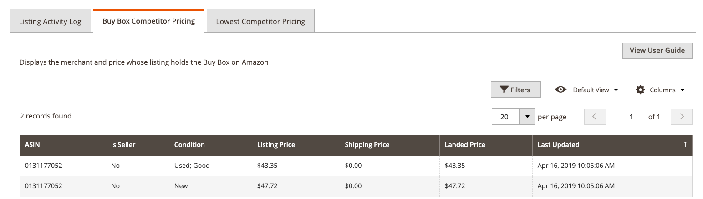

# Afficher les détails de la liste

Le _[!UICONTROL Product Listing Details]_La page affiche des informations supplémentaires sur vos principales listes de produits, y compris le journal d’activité de liste qui affiche les modifications sur un SKU/produit individuel. Ces informations peuvent vous aider à comprendre les mesures de compétitivité de vos produits et des modifications individuelles des SKU/produits. Informations supplémentaires sur cette page :

- **[!UICONTROL Listing Details]** - Détails du produit, notamment le SKU Nom et Vendeur Amazon
- **[!UICONTROL Listing Activity Log]** - Historique de toutes les modifications apportées à cette liste, telles que les modifications de prix et de quantité/stock. Aucune autre action n’est requise. Ce journal peut être consulté pour comprendre l’historique des modifications.
- **[!UICONTROL Buy Box Competitor Pricing]** - Données pour Amazon [[!DNL Buy Box]](./buy-box-competitor-pricing.md) tarification du statut et des concurrents
- **[!UICONTROL Lowest Competitor Pricing]** - Informations sur le prix du concurrent Amazon le plus bas et informations de retour

Les pages d’accueil du canal de vente Amazon partagent certaines [contrôles workspace](./workspace-controls.md) qui vous permettent de personnaliser les données affichées.

## Détails de la liste

Les informations sur les produits affichées incluent :

- _[!UICONTROL Amazon Name]_
- _[!UICONTROL Catalog (Magento) SKU]_
- _[!UICONTROL Amazon Seller SKU]_

## Journal des activités d’énumération {#listing-activity-log}

Affiche toutes les activités récentes de la liste Amazon. Les informations affichées sont les suivantes :

- SKU du vendeur Amazon : Identifie le SKU (Stock Keeping Unit) défini pour la liste.
- ASIN : Identifie l’identifiant de produit Amazon à 10 chiffres.
- Action de liste : Identifie le type d’action survenue pour la liste.
- Commentaires : Fournit des détails supplémentaires sur le type d’action de liste qui s’est produite.
- Exécuté À : Identifie la date et l’heure auxquelles l’action a eu lieu.

__

## Prix des concurrents Buy Box {#buy-box-competitor-pricing}

Cet onglet affiche des informations sur le commerçant Amazon qui détient le [[!DNL Buy Box]](./buy-box-competitor-pricing.md) position de la liste. Ces informations peuvent être utilisées pour comprendre le positionnement des prix de vos concurrents sur Amazon. Les informations affichées sont les suivantes :

- ASIN : Identifiant de produit Amazon à 10 chiffres.
- Is Seller : Identifie si vous êtes la variable [!DNL Buy Box] vendeur. Options Oui / Non.
- Condition : Identifie la condition définie pour la liste.
- Prix d’inscription : Identifie le prix auquel la liste a été publiée.
- Prix de livraison : Identifie le prix d’expédition ajouté à la liste.
- Prix d’entrée : Identifie le prix de l’offre plus le prix d’expédition pour la liste.
- Dernière mise à jour : Identifie la date et l’heure auxquelles les informations de tarification ont été mises à jour à partir d’Amazon.

## Prix du concurrent le plus bas {#lowest-competitor-pricing}

Cet onglet affiche des informations sur les concurrents Amazon pour la même liste. Ces informations peuvent être utilisées pour comprendre le positionnement des prix et [prix concurrentiel le plus bas](./lowest-competitor-pricing.md). Les informations affichées sont les suivantes :

- ASIN : Identifiant de produit Amazon à 10 chiffres.
- Condition : Identifie la condition définie pour la liste.
- Canal d’exécution : Identifie la personne responsable de l’exécution. Options : Marchand/Amazon.
- Prix d’inscription : Identifie le prix auquel la liste a été publiée.
- Prix de livraison : Identifie le prix d’expédition ajouté à la liste.
- Prix d’entrée : Identifie le prix de l’offre plus le prix d’expédition pour la liste.
- Évaluation des commentaires : Identifie l’évaluation des commentaires Amazon pour le marchand au prix le plus bas.
- Nombre de commentaires : Identifie le nombre de commentaires Amazon pour le marchand au prix le plus bas.
- Dernière mise à jour : Identifie la date et l’heure auxquelles les informations de tarification ont été mises à jour à partir d’Amazon.

