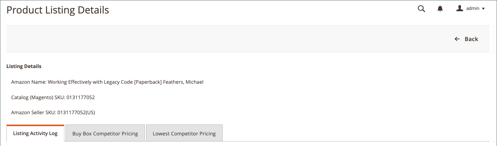

# Afficher les détails de la liste

Le _[!UICONTROL Product Listing Details]_affiche des informations supplémentaires sur vos annonces de produits actives, y compris le journal d&#39;activité d&#39;annonce qui affiche les modifications sur une UGS/un produit individuel. Ces informations peuvent vous aider à comprendre les mesures concurrentielles sur vos produits et sur les modifications individuelles des UGS/produits. Des informations supplémentaires sur cette page comprennent :

- **[!UICONTROL Listing Details]** - Détails du produit, notamment le SKU Nom et Vendeur Amazon
- **[!UICONTROL Listing Activity Log]** - Historique de toutes les modifications apportées à cette annonce, telles que les prix et les variations de quantité/stock. Aucune autre action n’est requise. Ce journal est fourni pour révision afin de comprendre l’historique des modifications.
- **[!UICONTROL Buy Box Competitor Pricing]** - Données pour Amazon [[!DNL Buy Box]](./buy-box-competitor-pricing.md) statut et prix compétitif
- **[!UICONTROL Lowest Competitor Pricing]** - Informations sur les tarifs du concurrent le plus bas d&#39;Amazon et informations de retour

Les pages d&#39;accueil du canal de vente Amazon partagent certaines parties communes [commandes de l’espace de travail](./workspace-controls.md) qui vous permettent de personnaliser les données affichées.

## Détails de la liste

Les informations de produit affichées comprennent :

- _[!UICONTROL Amazon Name]_
- _[!UICONTROL Catalog (Magento) SKU]_
- _[!UICONTROL Amazon Seller SKU]_

## Journal d&#39;activité d&#39;annonce {#listing-activity-log}

Affiche toutes les activités récentes pour la liste Amazon. Les informations affichées comprennent :

- UGS du vendeur Amazon : Identifie la référence SKU (Stock Keeping Unit) définie pour la mise en vente.
- ASIN : Identifie l&#39;identificateur de produit Amazon à 10 chiffres.
- Action d&#39;annonce : Identifie le type d&#39;action qui s&#39;est produit pour la liste.
- Commentaires : Fournit des détails supplémentaires relatifs au type d&#39;action d&#39;annonce qui s&#39;est produite.
- Exécuté à : Identifie la date et l&#39;heure auxquelles l&#39;action a eu lieu.

__

## Prix des concurrents Buy Box {#buy-box-competitor-pricing}

Cet onglet affiche des informations sur le commerçant Amazon qui détient le [[!DNL Buy Box]](./buy-box-competitor-pricing.md) position de la liste. Ces informations peuvent être utilisées pour comprendre le positionnement des prix de vos concurrents sur Amazon. Les informations affichées comprennent :

- ASIN : Identificateur de produit Amazon à 10 chiffres.
- Est le vendeur : Identifie si vous êtes le [!DNL Buy Box] vendeur. Options Oui / Non
- Condition : Identifie la condition définie pour la mise en vente.
- Prix d&#39;annonce : Identifie le prix auquel l&#39;annonce a été publiée.
- Prix d&#39;expédition : Identifie le prix d&#39;expédition ajouté à la liste.
- Prix d&#39;entrée : Identifie le prix d&#39;annonce plus le prix d&#39;expédition pour l&#39;annonce.
- Dernière mise à jour : Identifie la date et l’heure auxquelles les informations de tarification ont été mises à jour à partir d’Amazon.

## Prix compétitif le plus bas {#lowest-competitor-pricing}

Cet onglet affiche des informations sur les concurrents Amazon pour la même annonce. Ces informations peuvent être utilisées pour comprendre le positionnement des prix et [prix compétitif le plus bas](./lowest-competitor-pricing.md). Les informations affichées comprennent :

- ASIN : Identificateur de produit Amazon à 10 chiffres.
- Condition : Identifie la condition définie pour la mise en vente.
- Canal d&#39;exécution : Identifie la partie responsable de la réalisation. Options : Marchand/Amazon.
- Prix d&#39;annonce : Identifie le prix auquel l&#39;annonce a été publiée.
- Prix d&#39;expédition : Identifie le prix d&#39;expédition ajouté à la liste.
- Prix d&#39;entrée : Identifie le prix d&#39;annonce plus le prix d&#39;expédition pour l&#39;annonce.
- Évaluation des commentaires : Identifie la note de rétroaction Amazon pour le commerçant le moins cher.
- Nombre de commentaires : Identifie le nombre de commentaires Amazon pour le commerçant le moins cher.
- Dernière mise à jour : Identifie la date et l’heure auxquelles les informations de tarification ont été mises à jour à partir d’Amazon.

