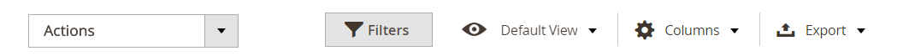

# Contrôles Workspace

Canal de vente Amazon [page d&#39;accueil](./amazon-sales-channel-home.md) dispose de certains contrôles d’espace de travail courants, notamment Filtres, Vue par défaut, Colonnes et Exporter. Toutes les pages n’ont pas les mêmes options de contrôle.

## Actions

Le _[!UICONTROL Actions]_selector fournit une liste des actions disponibles pour un utilisateur pour une page. Lorsque cette option est sélectionnée, l’action est appliquée à tous les éléments sélectionnés. Pour appliquer une action à un élément spécifique, cochez la case dans la première colonne de chaque élément et sélectionnez une option sous_[!UICONTROL Actions]_.

Par exemple, lorsque le sélecteur s’affiche sur la page _[!UICONTROL Attributes]_, il inclut la variable_[!UICONTROL Re-import Product Attribute Values]_ action. Le choix de cette action enchaîne la valeur correspondante [!DNL Amazon Seller Central] et actualise la variable [!DNL Commerce] les données de chacun des éléments de magasin Amazon cochés dans la colonne de gauche.

## Filtres

Le _[!UICONTROL Filters]_Le contrôle affiche les options permettant de limiter les données affichées dans le tableau. Les options de filtre sont basées sur les colonnes sélectionnées dans la commande Colonnes . Les options de filtre s’affichent uniquement pour les colonnes activées dans le contrôle Colonnes .

Les contrôles de filtres peuvent inclure des calendriers dynamiques pour limiter les données pour les dates spécifiées, des menus déroulants pour les colonnes avec des sélections prédéfinies et des champs de texte libre pouvant contenir des données personnalisées.

L&#39;exemple suivant montre les paramètres de filtrage de la liste des commandes afin de n&#39;afficher que les commandes répondant aux critères suivants :

- Commandes passées entre 2/01/2019 et 2/07/2019, et
- Commandes avec un acheteur nommé de `Smith`, et
- Commandes dont l’état est `Shipped`.

Lorsque vos options de filtrage sont définies, cliquez sur **[!UICONTROL Apply Filters]** pour filtrer les données répertoriées. Cliquez sur Annuler pour quitter le contrôle Filtres sans appliquer.

Après avoir appliqué des filtres à vos données, **[!UICONTROL Active Filters]** des informations s’affichent. Vous pouvez cliquer sur le bouton  pour effacer une option de filtre spécifique ou cliquez sur **[!UICONTROL Clear All]** pour effacer tous les filtres appliqués.

## Affichage

La commande Affichage est basée sur les colonnes par défaut de la page. Elle est donc nommée Vue par défaut. Vous pouvez ajouter ou supprimer des colonnes disponibles à l’aide de la commande Colonnes . Lorsque vous personnalisez vos colonnes, vous pouvez alors enregistrer la vue sous la forme d’une vue personnalisée dans la commande Affichage .

Lorsque vos colonnes sont ajoutées ou supprimées de l’affichage de la page :

1. Cliquez sur **[!UICONTROL Default View]** > **[!UICONTROL Save View As...]**.

1. Saisissez un nom pour la vue.

1. Pour enregistrer la vue personnalisée, cliquez sur l’icône de flèche.

Dans cet exemple, la variable _ID de commande_ est ajoutée dans le contrôle Colonne et enregistrée en tant qu’affichage personnalisé. Notez qu’une fois le nom de la vue personnalisée enregistré, celui de la vue a changé. _Affichage par défaut_ au nom saisi.

Vous pouvez basculer entre les vues en sélectionnant la vue souhaitée dans la _[!UICONTROL View]_.

Si vous souhaitez supprimer ou modifier le nom de votre vue personnalisée, cliquez sur l’icône représentant un crayon. Vous pouvez ensuite saisir un autre nom ou cliquer sur l’icône de corbeille pour supprimer la vue personnalisée. La vue par défaut ne peut pas être supprimée.

## Colonnes

Le contrôle Colonnes permet d’ajouter ou de supprimer des colonnes de données de l’affichage de la page. Chaque page du canal de vente Amazon comporte une combinaison prédéfinie de colonnes de données, mais la plupart des pages disposent de colonnes supplémentaires. Si aucune colonne supplémentaire n’est disponible, vous pouvez toujours supprimer les colonnes par défaut de l’affichage.

L’exemple suivant illustre un contrôle Colonnes . Les options cochées correspondent aux en-têtes de colonne affichés sur la page.

- Pour ajouter une colonne de données à votre page, cochez la case .
- Pour supprimer une colonne de données de votre page, ne cochez pas la case.

Les modifications apportées à la case à cocher s’affichent immédiatement. Si vous effectuez des modifications et que vous quittez la page, la page revient à l’affichage de colonne par défaut. Pour les modifications que vous effectuez régulièrement, vous pouvez enregistrer les modifications de colonnes en tant que vue personnalisée dans la commande Affichage . Vous pouvez ensuite basculer dans le contrôle Vue sans avoir à ajouter ou supprimer des colonnes manuellement.

Vous pouvez cliquer sur **[!UICONTROL Reset]** pour rétablir les paramètres par défaut des options, vous pouvez cliquer sur **[!UICONTROL Cancel]** pour quitter sans vos modifications.

## Exporter

L&#39;option Exporter permet d&#39;exporter les données vers un fichier de données pouvant être importé dans un logiciel tiers ou dans une base de données distincte. Les données exportées sont limitées aux données affichées. Si nécessaire, veillez à ajouter ou supprimer des colonnes avant d&#39;utiliser le contrôle Export .

Lorsque vous êtes prêt à exporter vos données, sélectionnez une option de format d’exportation et cliquez sur **[!UICONTROL Export]**.

- CSV : fichier de valeurs séparées par des virgules contenant des données de texte brut.
- Excel XML : format de données de feuille de calcul XML (généralement utilisé pour les utilisateurs d’Excel).

Le fichier de données généré est automatiquement enregistré dans le dossier désigné pour les téléchargements.

