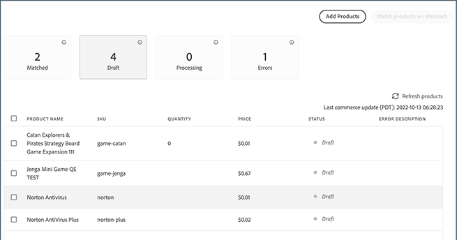

# Connecter les listes à Walmart

Comme les autres marchés, [!DNL Walmart] permet aux vendeurs tiers de répertorier les articles vendus par d’autres personnes.

- [!DNL Walmart Marketplace] utilise des identifiants de produit comme UPC et GTIN pour faire correspondre les produits aux listes [!DNL Walmart Marketplace] existantes.

- Pour les produits correspondants, la liste Walmart Marketplace est mise à jour afin d’inclure l’offre de produit [!DNL Commerce] lorsque vous connectez un produit de [!DNL Channel Manager].

- En règle générale, les offres de produits dont les prix sont les plus bas apparaissent en premier dans la liste [!DNL Walmart Marketplace], mais d’autres facteurs tels que les révisions affectent également le placement.

## Correspondance de produits

Lorsque vous faites correspondre des produits, Channel Manager envoie les données de produit à [!DNL Walmart Marketplace] pour rechercher des listes existantes avec des valeurs d’attribut correspondant à l’attribut de produit [!DNL Commerce] mappé. Les critères de correspondance sont déterminés par la [configuration de mappage d’attributs](map-catalog-attributes.md) pour votre canal de magasin.

Si une correspondance est trouvée, la liste de produits existante est mise à jour pour ajouter votre offre.

### Conditions préalables

Avant de faire correspondre des produits, vérifiez que les valeurs de vos attributs de catalogue de produits répondent aux exigences de Walmart et configurez les paramètres d’attributs de produit. Voir [Mappage des attributs de catalogue](map-catalog-attributes.md).

#### Sélection et mise en correspondance de produits

1. Ouvrez un canal de vente connecté.

1. À partir de **[!UICONTROL Listings]**, sélectionnez les produits à faire correspondre qui sont à l’état *[!UICONTROL Draft]*.

   {width="500" zoomable="yes"}

1. Sélectionnez **[!UICONTROL Match Products]**.

   Un message indique le nombre de produits envoyés pour la correspondance.

   L’état des produits sélectionnés passe à [!UICONTROL *Traitement*] jusqu’à la fin de l’opération de correspondance. Cela peut prendre jusqu’à 30 minutes pour que Walmart Marketplace termine l’opération de match.

### Vérifier l’état de correspondance

Une fois la correspondance terminée, sélectionnez **[!UICONTROL Refresh products]** pour afficher l’état actuel du produit. *Correspondance* ou *Erreur*.

- **[!UICONTROL Match]** indique que la correspondance du produit a été établie. Votre offre de produit a été connectée à une liste Walmart Marketplace existante. Si le [magasin Marketplace n&#39;est pas actif](walmart-requirements.md#walmart-marketplace-store-status), *[!UICONTROL Staged for Match]* s&#39;affiche dans la colonne *[!UICONTROL Status detail]*. Les produits intermédiaires sont automatiquement connectés lorsque le magasin [!DNL Walmart Marketplace] est activé.

- **[!UICONTROL Error]** indique que l’opération de correspondance a échoué en raison de l’un des problèmes suivants :

   - [!DNL Channel Manager] n’a pas pu envoyer pour correspondance en raison d’un problème de connexion.

   - Aucune correspondance n’a été trouvée.

   - Correspondance trouvée, mais la liste ne peut pas être connectée car [!DNL Walmart Marketplace] a renvoyé un code d’erreur. Pour plus d’informations sur le problème, voir **[!UICONTROL Error Description]** .

### Liste à cocher sur Walmart

Après avoir mis en correspondance les produits, passez en revue la liste de produits mise à jour et vérifiez les détails du produit, le prix et la quantité d’inventaire dans le tableau de bord [[!UICONTROL Walmart Marketplace Seller Account Items]](https://seller.walmart.com/items-and-inventory/manage-items) pour examiner le produit mis à jour.

### Dépannage des erreurs de correspondance de produit

Si l’opération de correspondance de produit échoue avec une erreur, le message d’erreur s’affiche dans la colonne *[!UICONTROL Status detail]* de la liste de produits [!UICONTROL Channel Manager].

Les erreurs courantes renvoyées sont des valeurs d’ID de produit mal formatées ou des attributs obligatoires manquants.

#### Correction des valeurs d’ID de produit

| Type | Description | Exemple |
|------|--------------------------------------------------------------------------------------------------------------------------------------------------------------------------------|---------------------------------------------|
| UPC | GTIN-12, nombre à 12 chiffres comprenant un chiffre de contrôle.   Si votre CUP comporte moins de 12 chiffres, tels que l’UPC-E à 8 chiffres, ajoutez des zéros de fin pour répondre à l’exigence. | Passer de `45678912345` à `045678912345` |
| GTIN | GTIN-14, nombre à 14 chiffres incluant un chiffre de contrôle.   Si votre GTIN comporte moins de 14 chiffres, ajoutez des zéros de début   pour répondre à la demande. | Remplacez `456789123456` par `0045678912345` |
| EAN | GTIN-13, nombre à 13 chiffres incluant un chiffre à cocher.   Si votre EAN comporte moins de 13 chiffres, ajoutez des  zéros de début pour répondre à la demande. | Passer de `4567891234` à `0004567891234` |

Pour plus d’informations sur les codes d’erreur Walmart Marketplace, consultez l’ [aide de Walmart Seller](https://sellerhelp.walmart.com/s/guide?article=000005844).

## Charger de nouvelles listes de produits

Pour les produits qui ne correspondent pas à Walmart Marketplace, utilisez un modèle Excel de catégorie de produits Walmart pour charger en masse des listes de produits. Vous renseignez le modèle Walmart à l’aide des données du catalogue de produits exportées à partir de votre instance [!DNL Commerce].

Pour les nouvelles listes de produits, vérifiez votre catalogue de produits pour vous assurer que les produits que vous prévoyez de vendre sur Walmart Marketplace possèdent les attributs requis pour les listes de produits Walmart Marketplace.

**Exigences en attributs-listes Walmart Marketplace**

| **Attribut** | **Niveau d’exigence** |
|--------------------------|-----------------------|
| SKU | Obligatoire |
| Nom du produit | Obligatoire |
| Type d’ID de produit | Obligatoire |
| ID de produit | Obligatoire |
| Marque | Obligatoire |
| Description courte | Obligatoire |
| Prix de vente | Obligatoire |
| Description du site | Obligatoire |
| URL de l’image principale | Obligatoire |
| Poids de livraison | Obligatoire |
| Fonctionnalités clés | Recommandé |
| Numéro de modèle | Recommandé |
| Nom du fabricant | Recommandé |
| Numéro de pièce du fabricant | Recommandé |
| Taille | Recommandé |
| Couleur | Recommandé |
| URL de l’image principale | Facultatif |
| URL d’image supplémentaire | Facultatif |
| Fabricant | Facultatif |

### Conditions préalables

- Vérifiez que vous remplissez les [exigences de Walmart](walmart-requirements.md).

- Dans votre catalogue de produits [!DNL Commerce], vérifiez que la configuration de catalogue des produits à répertorier sur Walmart Marketplace comporte tous les attributs requis et que vous êtes conforme aux directives de contenu Walmart Marketplace.

- Vérifiez que la tâche cron est en cours d’exécution pour terminer l’opération d’exportation.

   - Pour les instances sur site, voir [Configuration et exécution de cron](https://experienceleague.adobe.com/docs/commerce-operations/configuration-guide/cli/configure-cron-jobs.html).

   - Pour l’infrastructure cloud Adobe, voir [Configuration des tâches cron](https://experienceleague.adobe.com/docs/commerce-cloud-service/user-guide/configure/app/properties/crons-property.html).

### Création du fichier de données de produit à charger

1. A partir de votre [compte Walmart Seller](https://login.account.wal-mart.com/authorize?responseType=code&amp;clientId=66620dfd-1f3f-479b-8b9c-e11f36c5438b&amp;scope=openId&amp;redirectUri=https://seller.walmart.com/resource/login/sso/torbit&amp;nonce=SX17QLMBKR&amp;state=ZBWWNZXXXM&amp;clientType=seller), téléchargez un modèle de liste de produits à partir du Walmart Seller Center.

   - Sur la page Eléments du catalogue de produits , sélectionnez **[!UICONTROL Add Items]**. Sélectionnez ensuite **[!UICONTROL Add items in bulk]**.

     {width="600" zoomable="yes"}

   - Sur la page de téléchargement, sélectionnez **[!UICONTROL Full Setup]**. Sélectionnez ensuite une catégorie d’articles et téléchargez le modèle de catégorie.

     {width="600" zoomable="yes"}

   - Vérifiez que le modèle comprend les attributs requis et recommandés pour la liste de produits.

1. Depuis l&#39;administrateur [!DNL Commerce], sélectionnez les données de produit à exporter à partir de votre site d&#39;Adobe [!DNL Commerce].

   - Dans l&#39;Admin, sélectionnez [!UICONTROL **Système** > Transfert de données > **Exporter**].

   - Sur la page [!UICONTROL Export] du champ [!UICONTROL Entity Type], sélectionnez [!UICONTROL **Products**].

   - Dans la table [!UICONTROL Entity Attributes], configurez les critères de sélection pour l’exportation des données de produit.

     Utilisez des filtres pour sélectionner et configurer les valeurs d’attribut qui s’appliquent aux catégories de produits dans lesquelles vous vendez. Veillez à inclure les attributs requis et recommandés de Walmart. (Voir [Export Data](https://experienceleague.adobe.com/docs/commerce-admin/systems/data-transfer/data-export.html) dans le Guide de l’utilisateur de l’Adobe [!DNL Commerce] pour obtenir des instructions détaillées.)

     Pour omettre un attribut de l’exportation, cochez la case [!UICONTROL **Exclure**] au début de la ligne.

1. Faites défiler l’écran jusqu’à la fin de la table des attributs et sélectionnez [!UICONTROL **Continuer**] pour démarrer l’exportation des données.

   Le fichier d’exportation CSV est traité par le biais d’une file d’attente de messages à l’aide de tâches cron et enregistré dans `var/export/folder`. (Voir [Gestion des files d’attente de messages](https://experienceleague.adobe.com/docs/commerce-operations/configuration-guide/message-queues/manage-message-queues.html) dans le *Guide de configuration*.)

1. Ouvrez le modèle Excel pour la catégorie de produits Walmart Marketplace et utilisez les fonctionnalités de macro Excel pour fusionner les données de produit exportées dans le modèle Excel.

1. Chargez le fichier Excel avec les données de produit exportées.

   - Revenez à la page des éléments du catalogue de produits dans le [Walmart Seller Center](https://login.account.wal-mart.com/authorize?responseType=code&amp;clientId=66620dfd-1f3f-479b-8b9c-e11f36c5438b&amp;scope=openId&amp;redirectUri=https://seller.walmart.com/resource/login/sso/torbit&amp;nonce=SX17QLMBKR&amp;state=ZBWWNZXXXM&amp;clientType=seller).

   - Sélectionnez [!UICONTROL **Ajouter des éléments** > **Ajouter des éléments en bloc**].
   - Faites glisser la feuille de calcul terminée vers la section Télécharger .
   - Sélectionnez [!UICONTROL **Submit**].
   - Sélectionnez le [!UICONTROL  **flux d’activité**] pour afficher la progression.

Pour obtenir des instructions complètes, reportez-vous à la section [Ajout d’éléments en bloc à l’aide de la spécification d’élément complète](https://sellerhelp.walmart.com/s/guide?article=000007680) dans l’ [!DNL *aide de Walmart Seller*].
