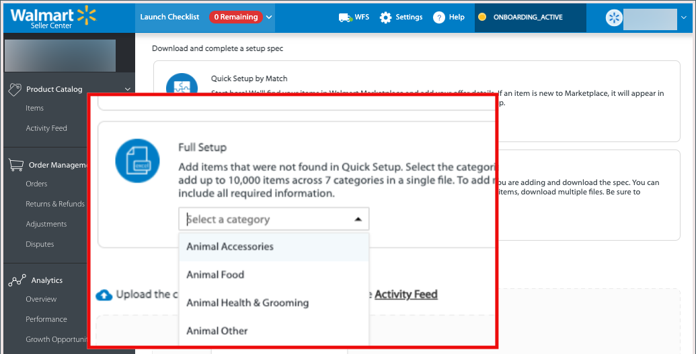

# Publier les listes vers Walmart

Comme d&#39;autres marchés, Walmart permet aux vendeurs tiers de répertorier les articles vendus par d&#39;autres personnes.

La plateforme utilise des identifiants de produit comme UPC et GTIN pour faire correspondre des articles déjà en vente.
Pour les produits correspondants, la liste existante de Walmart Marketplace est mise à jour afin d’inclure l’offre de produit Commerce.

En règle générale, les produits dont les prix sont les plus bas apparaissent en premier dans les résultats, mais d’autres facteurs comme les révisions affectent également le placement.

## Correspondance de produits

Lorsque vous faites correspondre des produits, Channel Manager envoie les données de produit à Walmart Marketplace pour rechercher des listes existantes avec des valeurs d’attribut correspondant à l’attribut de produit Commerce mappé. Les critères de correspondance sont déterminés par la variable [configuration du mappage d’attributs](map-product-attributes-for-matching.md) pour votre canal de magasin.

Si une correspondance est trouvée, la liste de produits existante est mise à jour pour ajouter votre offre.

### Conditions préalables

Avant de faire correspondre des produits, vérifiez que les valeurs d’attribut de votre catalogue de produits répondent aux exigences de Walmart et configurez les paramètres d’attribut. Voir [Configuration de la correspondance des produits](map-product-attributes-for-matching.md)

#### Sélection et mise en correspondance de produits

1. Ouvrez un canal de vente connecté.

1. De **[!UICONTROL Listings]**, sélectionnez les produits qui correspondent à *[!UICONTROL Draft]* statut.

   

1. Sélectionner **[!UICONTROL Match Products]**.

   Un message indique le nombre de produits envoyés pour la correspondance.

   

   L’état des produits sélectionnés passe à [!UICONTROL *Traitement*] jusqu’à la fin de l’opération de correspondance. Cela peut prendre jusqu’à 30 minutes pour que Walmart Marketplace termine l’opération de match.

### Vérifier l’état de correspondance

1. Sélectionner **Actualiser les produits** pour mettre à jour l’état le plus récent du produit.

1. Vérifiez l’état du produit.

   Une fois la correspondance terminée, l’état peut être *Correspondance* ou *Erreur*.

   * **[!UICONTROL Match]** indique que la correspondance du produit a été établie. Votre offre de produit a été publiée dans une liste Walmart Marketplace existante.

   * **[!UICONTROL Error]** indique l’un des éléments suivants :

      * Une erreur s’est produite et l’opération de correspondance a échoué.

      * Aucune correspondance n’a été trouvée.

      * Correspondance trouvée, mais produit publié en tant qu’évaluation car la variable [Le magasin Marketplace n’est pas principal](walmart-prerequisites.md#walmart-marketplace-store-status).

### Liste à cocher sur Walmart

Après avoir mis en correspondance les produits, passez en revue la liste de produits mise à jour et vérifiez les détails, le prix et la quantité de stock du produit. [[!UICONTROL Walmart Marketplace Seller Account Items] tableau de bord](https://seller.walmart.com/items-and-inventory/manage-items) pour consulter le produit mis à jour.

### Dépannage des erreurs de correspondance de produit

Si l’opération de correspondance de produit échoue, Walmart Marketplace renvoie un code d’erreur et Channel Manager affiche l’état d’erreur dans les informations de liste de produits.

Pour afficher le détail des messages d’erreur, survolez le **Erreur** libellé d’état. Les erreurs courantes renvoyées sont des valeurs d’ID de produit mal formatées ou des attributs obligatoires manquants.

#### Correction des valeurs d’ID de produit

| Type | Description | Exemple |
|------|--------------------------------------------------------------------------------------------------------------------------------------------------------------------------------|---------------------------------------------|
| UPC | GTIN-12, nombre à 12 chiffres comprenant un chiffre de contrôle.   Si votre CUP comporte moins de 12 chiffres, comme l’UPC-E à 8 chiffres, ajoutez des zéros de fin pour répondre à vos besoins. | Modifier à partir de `45678912345` to `045678912345` |
| GTIN | GTIN-14, nombre à 14 chiffres incluant un chiffre de contrôle.   Si votre GTIN comporte moins de 14 chiffres, ajoutez des zéros de début.  pour répondre aux exigences. | Modifier `456789123456` to `0045678912345` |
| EAN | GTIN-13, nombre à 13 chiffres incluant un chiffre à cocher.   Si votre EAN comporte moins de 13 chiffres, ajoutez au début  zéros pour répondre aux exigences. | Modifier à partir de `4567891234` to `0004567891234` |

Pour plus d’informations sur les codes d’erreur de Walmart Marketplace, reportez-vous à la section [Aide de Walmart Seller](https://sellerhelp.walmart.com/s/guide?article=000005844).

## Charger de nouvelles listes de produits

Pour les produits qui ne correspondent pas à Walmart Marketplace, utilisez un modèle Excel de catégorie de produits Walmart pour charger en masse des listes de produits. Vous renseignez le modèle Walmart à l’aide des données de catalogue de produits exportées à partir de votre instance Commerce.

Pour les nouvelles listes de produits, vérifiez votre catalogue de produits pour vous assurer que les produits que vous prévoyez de vendre sur Walmart Marketplace possèdent les attributs requis pour les listes de produits Walmart Marketplace.

**Listes Walmart Marketplace - Exigences en matière d’attributs**

| **Attribut** | **Niveau d’exigence** |
|--------------------------|-----------------------|
| SKU | Obligatoire |
| Nom du produit | Obligatoire |
| Type d’ID de produit | Obligatoire |
| ID de produit | Obligatoire |
| Marque | Obligatoire |
| Description courte | Obligatoire |
| Prix de vente | Obligatoire |
| Description du site | Obligatoire |
| URL de l’image principale | Obligatoire |
| Poids de livraison | Obligatoire |
| Fonctionnalités clés | Recommandé |
| Numéro de modèle | Recommandé |
| Nom du fabricant | Recommandé |
| Numéro de pièce du fabricant | Recommandé |
| Taille | Recommandé |
| Couleur | Recommandé |
| URL de l’image principale | Facultatif |
| URL d’image supplémentaire | Facultatif |
| Fabricant | Facultatif |

### Conditions préalables

* Vérifiez que vous avez rencontré le [Conditions préalables de Walmart](https://docs.google.com/document/d/1bEbCyVLXJQQsbZvEwetJvZKWQJOKoiw5Ia1uB4Bs4uo/edit#heading=h.k2lo9voad1gx).

* Dans votre catalogue de produits Commerce, vérifiez que la configuration de catalogue des produits à répertorier sur Walmart Marketplace comporte tous les attributs requis et que vous êtes conforme aux directives de contenu de Walmart Marketplace.

* Vérifiez que la tâche cron est en cours d’exécution pour terminer l’opération d’exportation.

   * Pour les instances sur site, voir [Configuration et exécution de cron](https://devdocs.magento.com/guides/v2.4/config-guide/cli/config-cli-subcommands-cron.html).

   * Pour connaître l’infrastructure cloud Adobe, voir [Configuration de tâches cron](https://devdocs.magento.com/cloud/configure/setup-cron-jobs.html).

### Création du fichier de données de produit à charger

1. À partir de [Compte Walmart Seller](https://login.account.wal-mart.com/authorize?responseType=code&amp;clientId=66620dfd-1f3f-479b-8b9c-e11f36c5438b&amp;scope=openId&amp;redirectUri=https://seller.walmart.com/resource/login/sso/torbit&amp;nonce=SX17QLMBKR&amp;state=ZBWWNZXXXM&amp;clientType=seller), téléchargez un modèle de liste de produits à partir du Walmart Seller Center.

   * Sur la page Eléments du catalogue de produits , sélectionnez **[!UICONTROL Add Items]**. Sélectionnez ensuite **[!UICONTROL Add items in bulk]**.

      

   * Sur la page de téléchargement, sélectionnez **[!UICONTROL Full Setup]**. Sélectionnez ensuite une catégorie d’articles et téléchargez le modèle de catégorie.

      

   * Vérifiez que le modèle comprend les attributs requis et recommandés pour la liste de produits.

1. Dans la [!DNL Commerce] Admin, sélectionnez les données de produit à exporter à partir de votre site Adobe Commerce.

   * Dans l’onglet Admin, sélectionnez [!UICONTROL **Système** > Transfert de données > **Exporter**].

   * Sur le [!UICONTROL Export] dans la [!UICONTROL Entity Type] champ, sélectionnez [!UICONTROL **Produits**].

   * Dans le [!UICONTROL Entity Attributes] configurez les critères de sélection de l’exportation des données de produit.
   ![Exportation de la page de données de produit dans [!UICONTROL Commerce Admin]](assets/walmart-seller-account-full-setup-download.png)

   Utilisez des filtres pour sélectionner et configurer les valeurs d’attribut qui s’appliquent aux catégories de produits dans lesquelles vous vendez. Veillez à inclure les attributs requis et recommandés de Walmart (voir [Exporter les données](https://docs.magento.com/user-guide/system/data-export.html) dans le Guide de l’utilisateur d’Adobe Commerce pour obtenir des instructions détaillées.)

   Pour omettre un attribut de l’exportation, sélectionnez la variable [!UICONTROL **Exclure**] au début de la ligne.

1. Faites défiler jusqu’à la fin du tableau d’attributs et sélectionnez [!UICONTROL **Continuer**] pour démarrer l&#39;export des données.

   Le fichier d’exportation CSV est traité par le biais d’une file d’attente de messages à l’aide de tâches cron et enregistré dans `var/export/folder`. (Voir [Gestion des files d’attente de messages](https://devdocs.magento.com/guides/v2.4/config-guide/mq/manage-message-queues.html) dans le *Guide du développeur de Commerce*.)

1. Ouvrez le modèle Excel pour la catégorie de produits Walmart Marketplace et utilisez les fonctionnalités de macro Excel pour fusionner les données de produit exportées dans le modèle Excel.

1. Chargez le fichier Excel avec les données de produit exportées.

   * Revenez à la page Eléments du catalogue de produits dans le [Centre des vendeurs Walmart](https://login.account.wal-mart.com/authorize?responseType=code&amp;clientId=66620dfd-1f3f-479b-8b9c-e11f36c5438b&amp;scope=openId&amp;redirectUri=https://seller.walmart.com/resource/login/sso/torbit&amp;nonce=SX17QLMBKR&amp;state=ZBWWNZXXXM&amp;clientType=seller).

   * Sélectionner [!UICONTROL **Ajout d’éléments** > **Ajout d’éléments en bloc**].
   * Faites glisser la feuille de calcul terminée vers la section Télécharger .
   * Sélectionner [!UICONTROL **Envoyer**].
   * Sélectionnez la [!UICONTROL  **Flux d’activité**] pour afficher la progression.

Pour obtenir des instructions complètes, voir [Ajout d’éléments en bloc à l’aide de la spécification d’élément complète](https://sellerhelp.walmart.com/s/guide?article=000007680) dans le [!DNL *Aide de Walmart Seller*].
